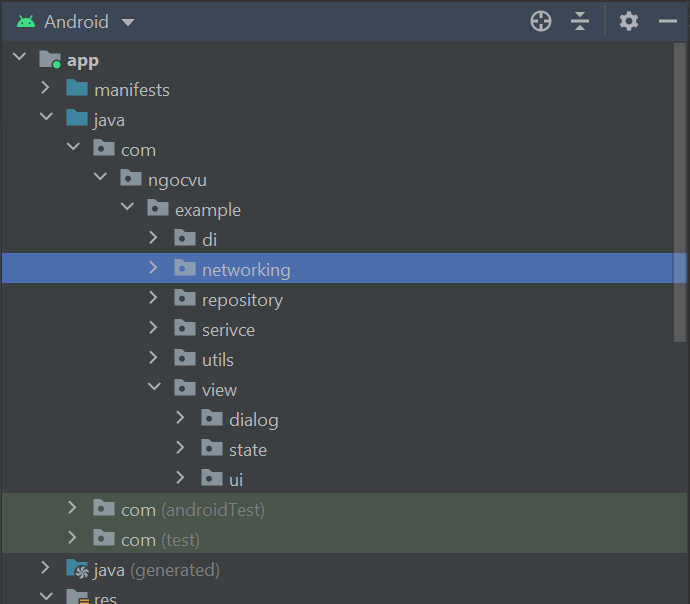
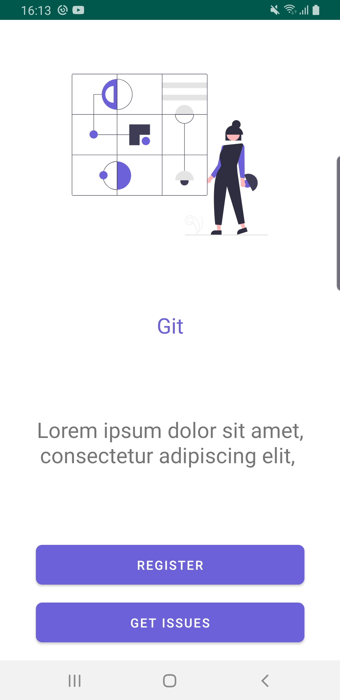
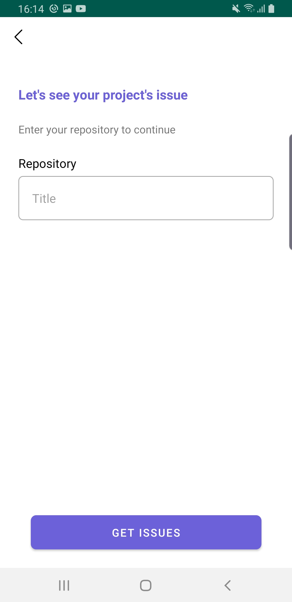
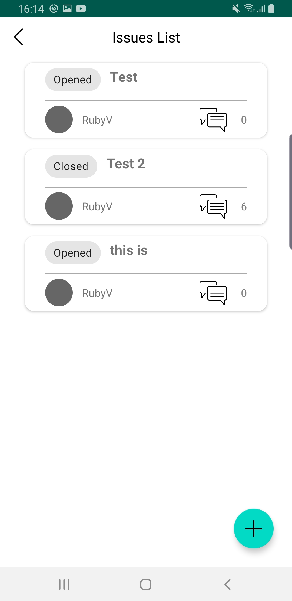
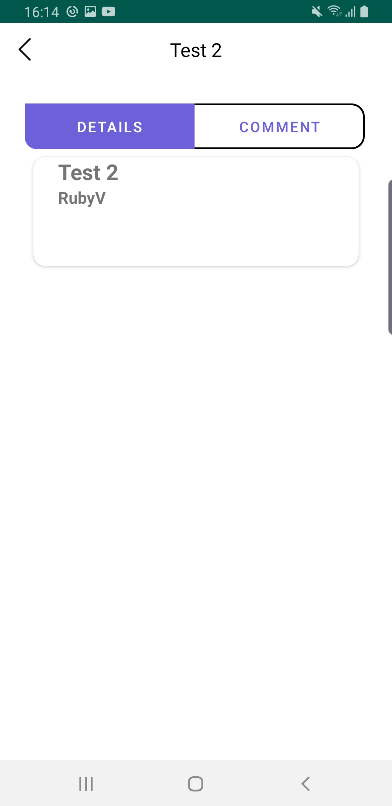
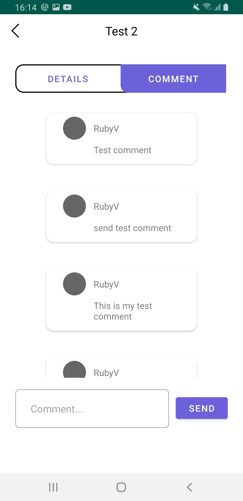

#### ngocvu_assignment

#### About this project
This app is an example of using Graphql with Android. The app implements MVVM architecture using Hilt, RxJava, OkHttp3,...
#### Project Structure

  

  

  

  
#### The app has the following packages:
  
1. **data**: It contains all the data accessing and manipulating components.
2. **di**: Dependency providing classes using Dagger2.
3. **UI**: View classes along with their corresponding ViewModel.
4. **utils**: Utility classes.
  
#### Communication between layers
  
1. UI calls method from ViewModel.
2. ViewModel then call repository and executes one or multiple Repositorie function.
3. The Repository returns data from one or multiple Data Sources(Remote-Rick and morty GraphQL , Local-Room DB). the repository is the single source of truth
5. Information flows back to the UI where we display the data fetched from data sources.
#### App function
App has these functions:
1. Query All Issues from a repository
2. Post a comment using FCM
3. Cache issue list data
4. Open/Close issues
5. Post comment
#### App third party dependency
  
1. RxJava3: https://github.com/amitshekhariitbhu/RxJava2-Android-Samples
2. Hilt: https://github.com/MindorksOpenSource/android-dagger2-example
3. OkHttp3: https://square.github.io/okhttp/
4. Apollo Graphql: https://github.com/apollographql/apollo-android
5. Timber : https://github.com/JakeWharton/timber
6. Android Material Design : https://material.io/develop/android
7. Navigation Graph: https://developer.android.com/guide/navigation/navigation-getting-started
8. LiveData: https://developer.android.com/topic/libraries/architecture/livedata
#### Highlight feature in this project and what incomplete and why it may not be working fully 
#### Highlight feature
I think I proud of this whole project as it's my first time working with Graphql. But if I have to 
choose one, I will choose cache data so that even when users offline, the app will show the latest
issues list. 
About UI is display issue details in two tabs to divide the data so that users won't feel overwhelmed by the amount of data. 
#### What is incomplete
When navigating back to the issue list/comment list the data will be duplicate I think it's because 
graphql is caching the data after calling.
When receiving notification, users will return to main screen instead of the current screen as I don't have time to implement this
Haven't re-render the list after mutation. 
#### Instruction to run this app 

1. https://github.com/settings/tokens - Go here to get your Personal Access Token 
2. Replace GITHUB_KEY with token you got from Github. 
3. As i'm currently using this query to get list issue
<pre>
query {
  repository(owner:"xxxx", name:"xxxxx") {
    name
    description
    forkCount
    url
  }
}
</pre>
You also need to change owner and name value to get the issue list of a repository you like. After
change, build the project before running. 

